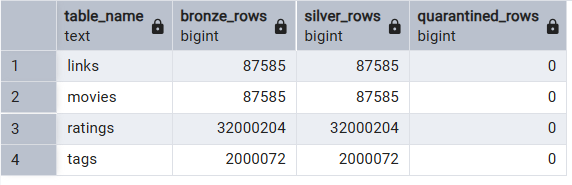

# Silver Layer — Data Quality Report

## 1. Summary
All four base silver tables were built from bronze with zero data
loss. 32,000,204 ratings and 2,000,072 tags processed with 0 rows
quarantined after validation rules were corrected. Two derived
tables (movie_metadata, user_ratings_master) were built successfully
on top of the validated base tables.

## 2. Row Counts

| Table   | Bronze     | Silver     | Quarantined |
|---------|-----------|-----------|-------------|
| links   | 87,585    | 87,585    | 0           |
| movies  | 87,585    | 87,585    | 0           |
| ratings | 32,000,204| 32,000,204| 0           |
| tags    | 2,000,072 | 2,000,072 | 0           |

silver.movie_metadata: 87,585 rows
silver.user_ratings_master: 32,000,204 rows

## 3. Validation Rules Applied

- Null checks on mandatory keys (UserId, MovieId, Title)
- Rating range check: must be between 0.5 and 5.0
- Timestamp range check: must fall within 1995-01-09 to 2023-10-13
- Duplicate check on ratings: (UserId, MovieId) must be unique,
  most recent kept
- No duplicate check applied to tags: a user may legitimately tag
  one movie multiple times

## 4. Quarantine Findings

Initial validation run flagged 109 rating rows as out-of-range on
timestamp. Investigation showed the boundary constant was set to
the start of the dataset's final day rather than its end, incorrectly
rejecting valid ratings made later that day. The boundary was
corrected and all 109 rows passed on re-run. Final quarantine count
across all tables: 0.

## 5. Known Limitations

- imdb_ratings and tmdb_ratings (silver) were not built. These
  require IMDb/TMDb API integration, which was marked on hold in
  the original sprint plan at the bronze layer. No gold table
  depends on this data.

